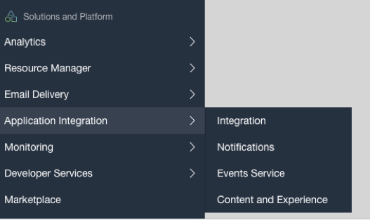
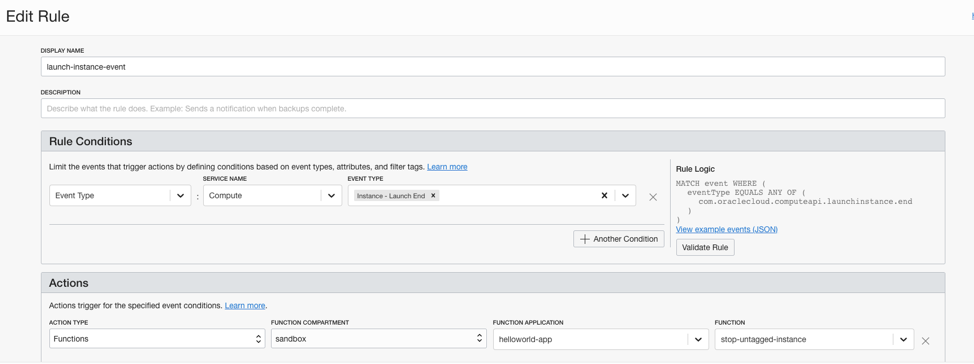
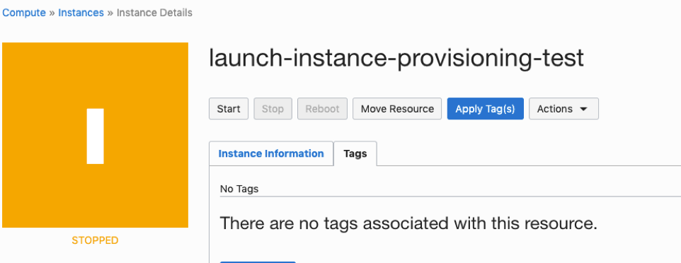

# Function for Stopping improperly tagged instance during provisioning

This is an example of a function to check if a compute instance is tagged correctly on provisioning. If not, stop the instance.

This function is trigged by the compute event -- **Instance - Launch End** which is generated by compute at the completion of instance provisioning whether it succeeds or fails.

This sample uses Oracle cloud infrastructure search to search for compute resources with the freeform tag with a tag key of **costcenter** and tag value of **1234**.

Uses the [OCI Python SDK](https://oracle-cloud-infrastructure-python-sdk.readthedocs.io/en/latest/index.html) to create a client that receive user information when called in the OCI or a valid config file exists.

As you make your way through this tutorial, look out for this icon .
Whenever you see it, it's time for you to perform an action.


## Prerequisites
Before you deploy this sample function, make sure you have run step A, B and C of the [Oracle Functions Quick Start Guide for Cloud Shell](https://www.oracle.com/webfolder/technetwork/tutorials/infographics/oci_functions_cloudshell_quickview/functions_quickview_top/functions_quickview/index.html)
* A - Set up your tenancy
* B - Create application
* C - Set up your Cloud Shell dev environment


## List Applications 
Assuming your have successfully completed the prerequisites, you should see your 
application in the list of applications.
```
fn ls apps
```


## Create or Update your Dynamic Group
In order to use other OCI Services, your function must be part of a dynamic group. For information on how to create a dynamic group, refer to the [documentation](https://docs.cloud.oracle.com/iaas/Content/Identity/Tasks/managingdynamicgroups.htm#To).

When specifying the *Matching Rules*, we suggest matching all functions in a compartment with:
```
ALL {resource.type = 'fnfunc', resource.compartment.id = 'ocid1.compartment.oc1..aaaaaxxxxx'}
```
Please check the [Accessing Other Oracle Cloud Infrastructure Resources from Running Functions](https://docs.cloud.oracle.com/en-us/iaas/Content/Functions/Tasks/functionsaccessingociresources.htm) for other *Matching Rules* options.


## Create or Update IAM Policies
Create a new policy that allows the dynamic group to *use instance-family*.


Your policy should look something like this:
```
Allow dynamic-group <dynamic-group-name> to use instance-family in compartment <compartment-name>
```
For more information on how to create policies, check the [documentation](https://docs.cloud.oracle.com/iaas/Content/Identity/Concepts/policysyntax.htm).


## Review and customize your function
Review the following files in the current folder:
* the code of the function, [func.py](./func.py)
* its dependencies, [requirements.txt](./requirements.txt)
* the function metadata, [func.yaml](./func.yaml)


## Deploy the function
In Cloud Shell, run the fn deploy command to build the function and its dependencies as a Docker image,
push the image to OCIR, and deploy the function to Oracle Functions in your application.


```
fn -v deploy --app <your app name>
```
e.g.
```
fn -v deploy --app myapp
```


Test
----
### Create A Cloud Event
To create a new cloud event rule, click on Application Integration -> Events Service in the sidebar menu:

  
  
  
 
 ### Click on 'Create Rule' and populate the form:
 
 
 
  
  In this case, the event is **Instance - Launch End** and the action to take is to call the function **stop-untagged-instance**
  
### Launch a Compute instance

  
  
  Launch an instance with no tags
  
  
  
  In a few seconds you should see that the instance has stopped because it wasn't tagged.
  
  

  
## Monitoring Functions

Learn how to configure basic observability for your function using metrics, alarms and email alerts:
* [Basic Guidance for Monitoring your Functions](../basic-observability/functions.md)
