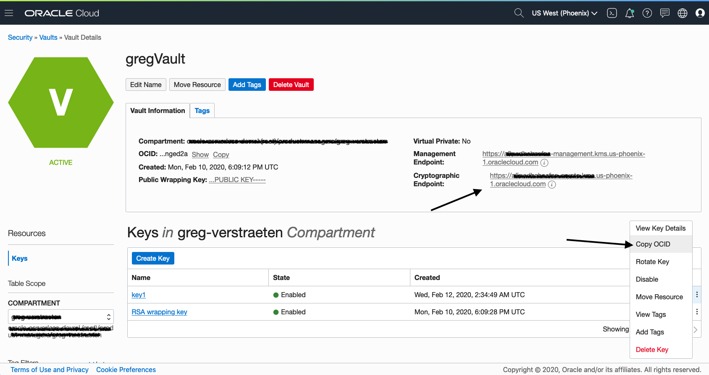

# Function that decrypts a cipher text using Vault keys
This function decrypts a cipher text using a Vault key. As a best practice, we do not recommend to expose your secrets via a return value of a function. This sample just demonstrate to use Vault keys in a function.

As you make your way through this tutorial, look out for this icon .
Whenever you see it, it's time for you to perform an action.


## Prerequisites
Before you deploy this sample function, make sure you have run step A, B and C of the [Oracle Functions Quick Start Guide for Cloud Shell](https://www.oracle.com/webfolder/technetwork/tutorials/infographics/oci_functions_cloudshell_quickview/functions_quickview_top/functions_quickview/index.html)
* A - Set up your tenancy
* B - Create application
* C - Set up your Cloud Shell dev environment


## List Applications 
Assuming your have successfully completed the prerequisites, you should see your 
application in the list of applications.
```
fn ls apps
```


## Create or Update your Dynamic Group
In order to use other OCI Services, your function must be part of a dynamic group. For information on how to create a dynamic group, refer to the [documentation](https://docs.cloud.oracle.com/iaas/Content/Identity/Tasks/managingdynamicgroups.htm#To).

When specifying the *Matching Rules*, we suggest matching all functions in a compartment with:
```
ALL {resource.type = 'fnfunc', resource.compartment.id = 'ocid1.compartment.oc1..aaaaaxxxxx'}
```
Please check the [Accessing Other Oracle Cloud Infrastructure Resources from Running Functions](https://docs.cloud.oracle.com/en-us/iaas/Content/Functions/Tasks/functionsaccessingociresources.htm) for other *Matching Rules* options.


## Create or Update IAM Policies
Create a new policy that allows the dynamic group to manage compute instances. We will grant `use` access to `keys` in the compartment.


Your policy should look something like this:
```
Allow dynamic-group <dynamic-group-name> to use keys in compartment <compartment-name>
```

For more information on how to create policies, check the [documentation](https://docs.cloud.oracle.com/iaas/Content/Identity/Concepts/policysyntax.htm).


## Review and customize the function
Review the following files in the current folder:
* the code of the function, [func.py](./func.py)
* its dependencies, [requirements.txt](./requirements.txt)
* the function metadata, [func.yaml](./func.yaml)


## Deploy the function
In Cloud Shell, run the *fn deploy* command to build the function and its dependencies as a Docker image, 
push the image to OCIR, and deploy the function to Oracle Functions in your application.


```
fn -v deploy --app <app-name>
```


## Create the Vault key and a cipher text


On the OCI console, navigate to *Security* > *Key Management*. If you don't already have a Vault created, create one. Create a key by clicking on `Create Key`. Provide a name for the key and click `Create Key`. 

In your vault, note the *Cryptographic Endpoint* and your key OCID.



Set the `KEY_OCID` and `CRYPTOGRAPHIC_ENDPOINTT` environement variables with the OCID of your Vault key and the Vault Endpoint. For example:
```
KEY_OCID='ocid1.key.oc1.phx.acdfdfna.abyxxxxxxxsqhycfq'
CRYPTOGRAPHIC_ENDPOINT='https://a5pdddfdfna-crypto.kms.us-phoenix-1.oraclecloud.com'
```

Set the `PLAIN_TEXT` environement variable with the text you will encrypt:
```
PLAIN_TEXT="my text"
```
Run the following command to get the encrypted version of your text:
```
oci kms crypto encrypt --key-id "$KEY_OCID" --endpoint "$CRYPTOGRAPHIC_ENDPOINT" \
    --plaintext "$( echo $PLAIN_TEXT | base64 -b0 )" | jq -r .data.ciphertext
```
The above command is for MacOS. For Linux, replace `base64 -b0` with `base64 -w0`.

The command returns a Cipher text, you will use it to invoke your function.


## Set the function configuration values
The function requires the following configuration values to be set:
- key_ocid
- cryptographic_endpoint


Use the *fn CLI* to set the config value:
```
fn config function <app-name> <function-name> key_ocid <Vault-key-OCID>
fn config function <app-name> <function-name> cryptographic_endpoint <Vault-Cryptographic-Endpoint>
```
e.g.
```
fn config function myapp oci-vault-decrypt-python key_ocid  "ocid1.key.oc1.phx.a5pedhchaafna.abyhqljt63augu4nwptqrvaw7gymh7zp7ihvgayo72pehd3sqhfproiaycfq"
fn config function myapp oci-vault-decrypt-python cryptographic_endpoint 'https://a5pedhchaafna-crypto.kms.us-phoenix-1.oraclecloud.com'
```


## Invoke the function
The function requires the cipher to be specified in the payload to be invoked. "cipher-text" is encrypted text you generated in the section [Create the Vault key and a cipher text](#Create the Vault key and a cipher text)


```
echo '{"cipher": "<cipher-text>"}' | fn invoke <app-name> oci-vault-decrypt-python
```
e.g.:
```
echo '{"cipher": "Ia+hS8+UYAEV8gr00ItHxsC1jhfslbzAA="}' | fn invoke myapp oci-vault-decrypt-python
```

Upon success, the function should return the decrypted text:
{"decryptedtext": "my text"}


## Monitoring Functions

Learn how to configure basic observability for your function using metrics, alarms and email alerts:
* [Basic Guidance for Monitoring your Functions](../basic-observability/functions.md)
