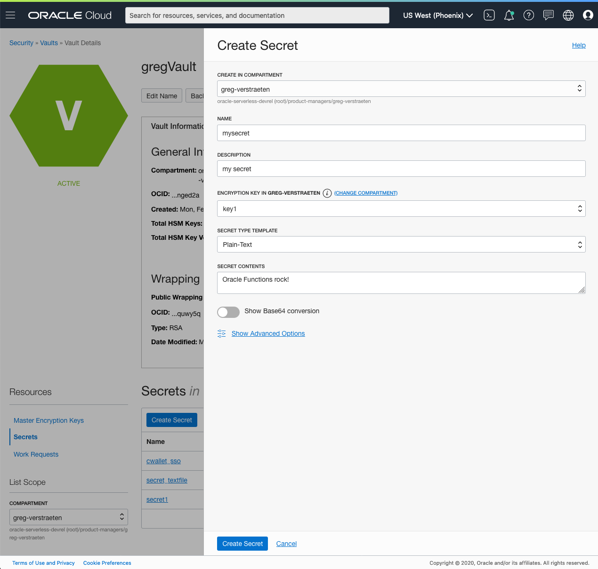
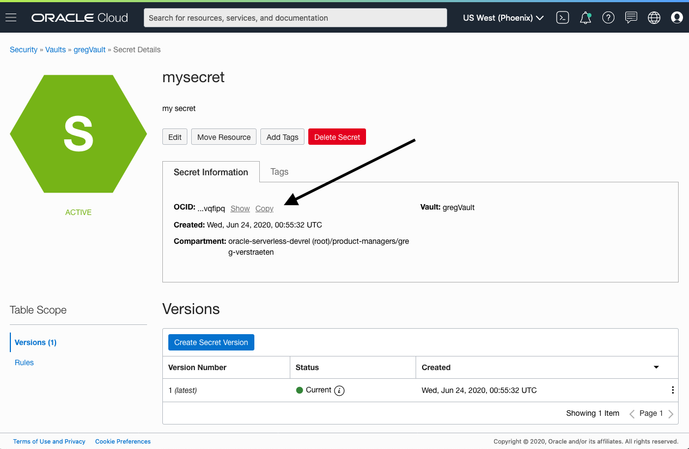

# Function that retrieves a secret
This function retrieves a secret from OCI Vault. The content of binary secrets are stored on the function filesystem and text secretx are returned decrypted by the function.
As a best practice, we do not recommend to expose your secrets via a return value of a function. This sample just demonstrate to use OCI Vault secrets in a function.

As you make your way through this tutorial, look out for this icon .
Whenever you see it, it's time for you to perform an action.


## Prerequisites
Before you deploy this sample function, make sure you have run step A, B and C of the [Oracle Functions Quick Start Guide for Cloud Shell](https://www.oracle.com/webfolder/technetwork/tutorials/infographics/oci_functions_cloudshell_quickview/functions_quickview_top/functions_quickview/index.html)
* A - Set up your tenancy
* B - Create application
* C - Set up your Cloud Shell dev environment


## List Applications 
Assuming your have successfully completed the prerequisites, you should see your 
application in the list of applications.
```
fn ls apps
```


## Create or Update your Dynamic Group
In order to use other OCI Services, your function must be part of a dynamic group. For information on how to create a dynamic group, refer to the [documentation](https://docs.cloud.oracle.com/iaas/Content/Identity/Tasks/managingdynamicgroups.htm#To).

When specifying the *Matching Rules*, we suggest matching all functions in a compartment with:
```
ALL {resource.type = 'fnfunc', resource.compartment.id = 'ocid1.compartment.oc1..aaaaaxxxxx'}
```
Please check the [Accessing Other Oracle Cloud Infrastructure Resources from Running Functions](https://docs.cloud.oracle.com/en-us/iaas/Content/Functions/Tasks/functionsaccessingociresources.htm) for other *Matching Rules* options.


## Create or Update IAM Policies
Create a new policy that allows the dynamic group to *use secret-family*.


Your policy should look something like this:
```
Allow dynamic-group <dynamic-group-name> to use secret-family in compartment <compartment-name>
```
For more information on how to create policies, check the [documentation](https://docs.cloud.oracle.com/iaas/Content/Identity/Concepts/policysyntax.htm).


## Review and customize your function
Review the following files in the current folder:
* the code of the function, [func.py](./func.py)
* its dependencies, [requirements.txt](./requirements.txt)
* the function metadata, [func.yaml](./func.yaml)


## Deploy the function
In Cloud Shell, run the fn deploy command to build the function and its dependencies as a Docker image,
push the image to OCIR, and deploy the function to Oracle Functions in your application.


```
fn -v deploy --app <your app name>
```
e.g.
```
fn -v deploy --app myapp
```


## Create a Vault and a Secret


On the OCI console, navigate to *Security* > *Vault*. If you don't already have a Vault created, create one. Create a key by clicking on `Create Key`. Provide a name for the key and click `Create Key`. 

To create a secret, click on *Create Secret* and provide a name, a description, a Vault key, the secret type (either Plain-Text or Base64), and the secret content.



If you want to store a binary file as a secret, use the *base64* command to generate base64 code and copy/paste it as the secret content.
```
base64 -i ~/Downloads/cwallet.sso
```

Click on the secret and copy its OCID




## Set the function configuration values
The function requires the following configuration values to be set:
- secret_ocid
- secret_type, the value should be either "text" or "binary"


Use the *fn CLI* to set the config value:
```
fn config function <app-name> <function-name> secret_ocid <secret ocid value>
fn config function <app-name> <function-name> secret_type <text or binary>
```
e.g.
```
fn config function myapp oci-vault-get-secret-python secret_ocid ocid1.vaultsecret.oc1.phx.xxxxxx
fn config function myapp oci-vault-get-secret-python secret_type text
```


## Invoke the function
Invoke the function as follows:


```
fn invoke <your app name> oci-vault-get-secret-python
```
e.g.:
```
fn invoke myapp oci-vault-get-secret-python
```

If the secret is text and you set the function configuration key "secret_type" to "text", the function returns the content of the secret, for example:
```
{"secret content": "Oracle Functions rock!"}
```

If the secret is binary data and you set the function configuration key "secret_type" to "binary", the function stores the content of the secret in a file in /tmp and returns the md5 checksum of the file, for example:
```
{'secret md5': 'a4269244e2eca44200bc04f83e0e4df0'}
```


## Monitoring Functions

Learn how to configure basic observability for your function using metrics, alarms and email alerts:
* [Basic Guidance for Monitoring your Functions](../basic-observability/functions.md)
